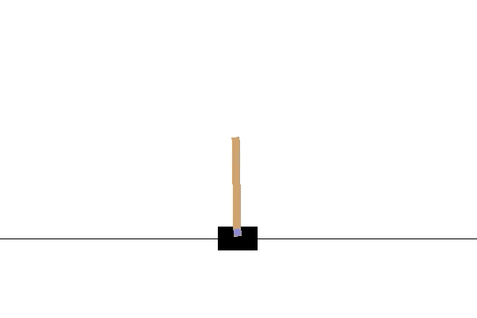

# boosted-RL
Training RL agents using boosted forests and non-Markovian rewards.

||
|:--:| 
| Infinite cartpol agent trained using augmented non-Markovian reward system |

The code implement two different approaches to training a reinforcement learning agent.

1)  An RL agent is synthesized from forests of decision trees, drawing inspiration from the AdaBoost framework for supervised learning. The algorithm proposed builds a forest using an oracle agent to narrow the search space. A system of weights is used to recruit trees that perform well in states where the forest is under-performing. This allows a strong agent to be built from several comparably weaker ones, often out-performing the oracle.

2)  

